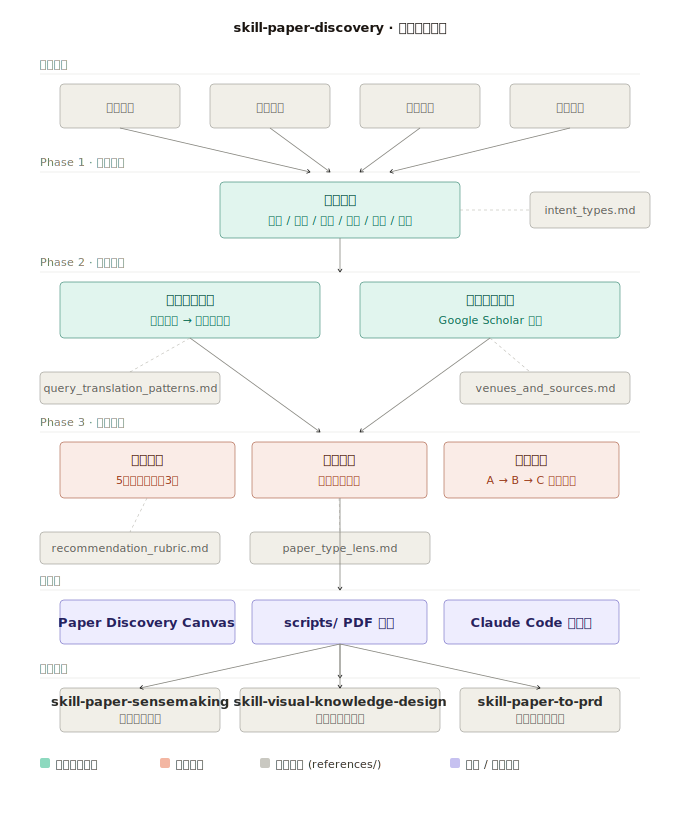

# skill-paper-discovery

**一个面向教育者、研究者和 EdTech Builder 的论文发现技能。**
**A paper discovery skill for educators, researchers, and EdTech builders.**

> 不是搜索引擎，而是翻译器——把你的问题翻译成值得读的论文。
> Not a search engine. A translator — from your question to the papers worth reading.

[edu-ai-builders](https://github.com/edu-ai-builders) · 作者：爱思考的伊伊子 · 播客：教育AI智造者

---

## 这是什么

大多数人找不到好论文，不是因为不会搜索，而是还没把自己的问题翻译成"论文世界里的问题"。

`skill-paper-discovery` 帮你完成这个翻译——从模糊的兴趣、具体的教学困惑或产品想法出发，找到现在最值得读的那几篇。

```
你的问题 → 研究问题 → 关键词 → 值得读的论文 → 阅读路径
```

---

## 核心能力

### 需求澄清

你不是"想找论文"。你可能是想入门一个新领域、解决一个教学问题、给产品找研究依据，或者验证一个假设。这些是完全不同的需求，需要完全不同的推荐逻辑。

大多数搜索工具把所有这些意图当成同一个动作处理：搜索。结果是你得到了一堆论文，但不知道哪篇对你现在有用。

这个 skill 先识别你是哪种意图——入门探索、问题求解、教学设计、产品开发、研究验证、论文延伸——再决定推荐什么、推荐几篇、怎么解释。同一个关键词，老师和 builder 搜出来的，应该是两套不同的论文和理由。

### 问题翻译

"学生用了 AI 反馈之后好像不反思了"——这是你的语言，不是论文的语言。

论文世界里描述这件事的词是：`metacognitive monitoring`、`desirable difficulties`、`over-reliance`、`feedback timing`。如果你搜索自己的语言，你什么都找不到；如果你不知道这些词，你也不知道自己在找什么。

这个 skill 把你说的话翻译成论文世界里的坐标——不只是给关键词，而是告诉你每个词背后对应的是哪几个研究脉络，每个脉络在问的是什么问题，以及去哪里搜（附带可点击的 Google Scholar 链接）。

### 精准推荐

Semantic Scholar 能给你 10,000 篇结果。Perplexity 能给你一份摘要列表。ChatGPT 能给你五篇听起来合理的论文，但其中有几篇可能根本不存在。这些都不是你真正需要的。

这个 skill 每次最多推荐 3 篇，并且对每一篇都必须回答同一个问题：**为什么是这篇，而不是和它很像的另外那篇？** 推荐理由不是"这篇很相关"，而是"这篇直接处理了你的具体问题，而另一篇更适合你之后读"。不推荐无法确认存在的论文——不确定就给关键词，而不是编造引用。

### 阅读路径

拿到一份论文清单和拿到一条阅读路径，是完全不同的两件事。清单告诉你有什么，路径告诉你先读什么、为什么这个顺序、每篇在你的理解里填补的是什么空白。

这个 skill 的每次输出都包含一条明确的阅读路线：用第一篇建立问题图景，用第二篇看设计或实现，用第三篇检验边界或看反驳证据。这不是随机排序，而是为你当前的认知状态设计的进入顺序。

---

## 架构图



---

## 三种模式

| 模式 | 适合场景 | 输出 |
|------|---------|------|
| **Guided**（默认） | 大多数用户 | 完整三阶段：需求澄清 → 关键词翻译卡 → 论文推荐卡（含阅读路径） |
| **Quick** | 时间有限，已有方向 | 直接给 1-3 篇推荐，每篇一句理由 |
| **Builder** | 做产品 / 工具的人 | 标准输出 + 产品启发、可复用交互模式 |

---

## 文件结构

```
skill-paper-discovery/
├── SKILL.md                              # 主逻辑：三阶段工作流 + 指令系统
├── references/
│   ├── intent_types.md                   # 六种用户意图 + 识别规则
│   ├── paper_type_lens.md                # 六种论文类型 + 对应阅读视角
│   ├── query_translation_patterns.md     # 用户语言 → 关键词翻译模式库
│   ├── venues_and_sources.md             # 会议/期刊/平台速查 + Google Scholar 指南
│   └── recommendation_rubric.md         # 五维推荐评分框架
├── scripts/
│   ├── search_semantic_scholar.py        # Semantic Scholar API 搜索（官方免费）
│   ├── search_arxiv.py                   # arXiv 搜索 + 免费 PDF 直链
│   └── fetch_pdf.py                      # 单个 / 批量 PDF 下载
└── assets/
    └── paper-discovery-canvas.html       # AI-powered 可视化前端
```

---

## Paper Discovery Canvas

`assets/paper-discovery-canvas.html` 是这个 skill 的前端界面，支持三种使用方式：

**① claude.ai Artifact（推荐展示用）**
在 claude.ai 里作为 Artifact 运行，平台自动处理认证，无需任何配置。

**② 本地文件**
用浏览器直接打开，填入 Anthropic API Key 即可使用。Key 仅存在浏览器内存，不会上传。获取：[console.anthropic.com](https://console.anthropic.com)

**③ 配合 Claude Code**
加载本 skill，Claude Code 执行完整工作流，`scripts/` 负责搜索和下载 PDF。

---

## 快捷指令

| 指令 | 行为 |
|------|------|
| `/quick` | 切换到快速推荐模式 |
| `/builder` | 切换到产品视角模式 |
| `/map` | 只输出关键词和搜索地图 |
| `/more` | 同方向再补充 3 篇 |
| `/adjacent` | 推荐相邻研究方向 |
| `/compare` | 对比当前推荐的几篇 |
| `/sense [n]` | 将第 n 篇传入深度意义建构 |

---

## 生态位置

```
skill-paper-discovery          ← 你在这里：找到值得读的论文
        ↓
skill-paper-sensemaking        ← 深度理解一篇论文
        ↓
skill-visual-knowledge-design  ← 把认知结构可视化
        ↓
skill-paper-to-prd             ← 把研究转化为产品设计
```

---

## 依赖安装

```bash
pip install arxiv    # search_arxiv.py 需要
# 其余脚本只用 Python 标准库，无需安装
```

---

## 适合谁用

- **老师**：想用学习科学研究改进教学设计
- **研究生 / 研究者**：需要快速锁定值得精读的文献
- **EdTech builder**：想把学术研究转化为产品功能
- **教育产品设计者**：需要研究依据支撑设计决策

---

*Part of the [edu-ai-builders](https://github.com/edu-ai-builders) open-source AI education OS.*
